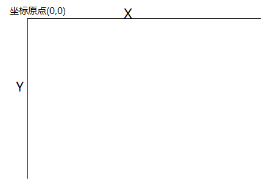

### 2d 渲染上下文
	canvas元素只是2d渲染上下文的包装器，它提供所有功能和方法。

```
	var canvas = document.getElementById('canvas');
	var context = canvas.getContext('2d');

```


### 坐标系统




### 注意
#####1. 如果一开始不给`canvas`设置宽高的话，到后面画东西的时候(例如计算鼠标坐标的时候)，是不准确的，且设置宽高的时候不能用css，只能用canvas标签的`width`和`height`属性，或者使用js的`setAttribute(...)`方法设置。
