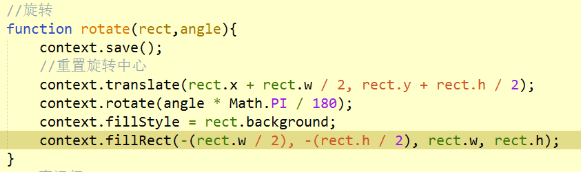

###变换

######1.旋转: `rotate(angle)`

> ######围绕圆点旋转图像angle弧度(`弧度=角度*Math.PI/180`，整数为顺时针，负数为逆时针)。

######2.缩放: `scale(scaleX,scaleY)`

> ######在x方向乘以scaleX，在y方向乘以scaleY，scaleX和scaleY的默认值都为1.0。

######3.转换: `translate(x,y)`

> ######将坐标原点移动到(x,y)，执行这个变换后，坐标(0,0)会变成之前由(x,y)表示的点。

###特别难用的变换方法：

######1. `transform(x轴缩放, y轴倾斜, x轴倾斜, y轴缩放, x轴平移, y轴平移)`

> ######可以说是rotote、scale、translate的综合方法,难用的点就是x轴倾斜和y轴倾斜太难把控。

######2. `setTransform(1, 0, 0, 1, 0, 0)`

> ######单位矩阵，用来初始化矩阵(初始化transfrom)。

###关于使用变换做图形旋转

> 1.使用`rotate()`做旋转的时候，旋转中心是图形的坐标，如果要图形自身旋转的话，需要使用`translate()`，改变旋转中心,因为会跟`fillRect()`的坐标叠加，所以利用`fillRect()`还原坐标。

> 2.因为变换方法是在当前变换基础上改变的，所以旋转的时候需要使用`save()`和`restore()`来改变换基础且使用`clearRect()`清空画布,否则会。。。

