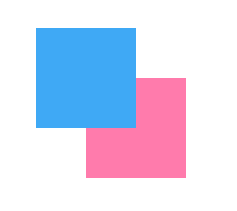
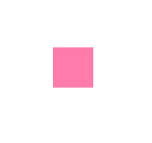

### 合成

> ######当源和目标重叠在一起时的状态。
> ######源(source) - 制新绘制的图形。
> ######目标(destination) - 已经绘制在2d上下文中。


### 全局合成属性

> ### 修改全局合成属性会影响修改之后所绘制的全部内容。


1. `globalAlpha`

> ###### 与`fillStyle`rgba值一样改变透明度的效果，0.0(全透明)~0.1(不透明)，默认值是1.0。

##### 写法

```
	globalAlpha = 0.5;
```


2. `globalCompositeOperation`

> ### 改变源或目标其中一个的属性。


3. `globalCompositeOperation = source-over`

> ###### 源覆盖在目标上。


4. `globalCompositeOperation = destination-over`

> ###### 目标覆盖在源上。




5. `globalCompositeOperation = source-atop`

> ###### 只显示源和目标重叠且源在上的部分和目标没有重叠的部分。


6. `globalCompositeOperation = destination-atop`

> ###### 只显示源和目标重叠且目标在上的部分和源没有重叠的部分。


7. `globalCompositeOperation = source-in`

> ###### 只显示源与目标重叠部分，且只显示源。




8. `globalCompositeOperation = destination-in`

> ###### 只显示源与目标重叠部分，且只显示目标。


9. `globalCompositeOperation = source-out`

> ###### 只显示源没有重叠的部分。


10. `globalCompositeOperation = destination-out`

> ###### 只显示目标没有重叠的部分。


11. `globalCompositeOperation = lighter`

> ###### 与顺序无关，显示源和目标，且重叠部分显示白色。


12. `globalCompositeOperation = copy`

> ###### 与顺序无关，只显示源。


13. `globalCompositeOperation = xor`

> ###### 与顺序无关，重叠部分为透明。

