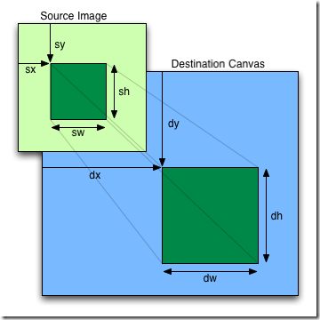

###将图片导入画布中

######`drawImage()`的两种调用方式

######1.`drawImage(image, x, y, width, height)`

> ######  image - dom的img元素或者Image对象的实例。

> ######  x - 图片原点的x轴坐标。

> ######  y - 图片原点的y轴坐标。 

> ######  width - 图片在画布的宽度。 

> ######  y - 图片在画布的高度。 

######2.`drawImage(image, sx, sy, sw, sh, dx, dy, dw, dh)`

> ### 注意： image参数可以用video元素代替，即不一定是图片可以是视频。

> ###### `drawImage()`是直接绘制到画布上，不需要`fillRect()`、`strokeRect()`这些方法。

> ###### `drawImage()`存在跨越问题，如果图片则可通过`img.crossOrigin = '域名'` 加上chrome的allow-origin-access...这个插件，不知道是插件起作用还是方法起作用...
