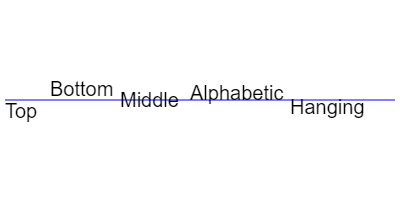

###绘制文本

######1. `fillText('文字内容', x, y)`

> ######填充文字。

######2. `strokeText('文字内容', x, y)`

> ######描边文字。

###样式

######1.  `font`

> ######表示文字样式，大小及字体，例如('10px Arial')。

######2. `textAlign`

> ######表示文字的对齐方式,可能的值有(start,end,left,right,center)建议不要使用left和right,使用start,end更为贴切,符合从左向右或者从右向左的文本排列。

######3. `textBaseLine`

> ######表示文本的基线。

