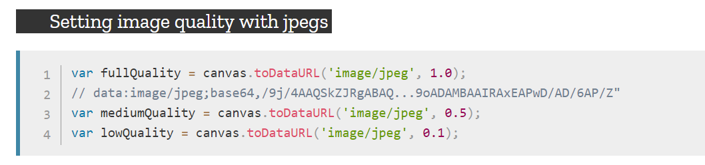

###将画布导出为图像

`canvas.toDataURL(type, encoderOptions)`

> ######将画布导出为图像，得到base64格式的字符串。

|参数|描述|
|:---:|:---:|
|type|导出的图像类型('image/png'),默认导出的也是png格式图片|
|encoderOptions|只有导出jpeg或者webp格式图片的(0~1的额外)质量选项，其他类型图片质量默认为0.92|

###写法

